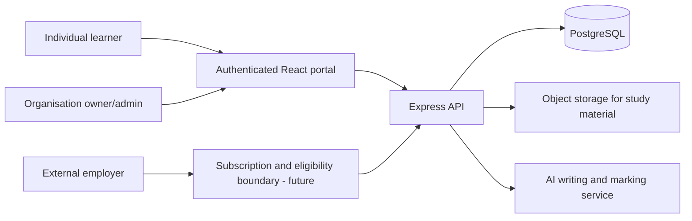
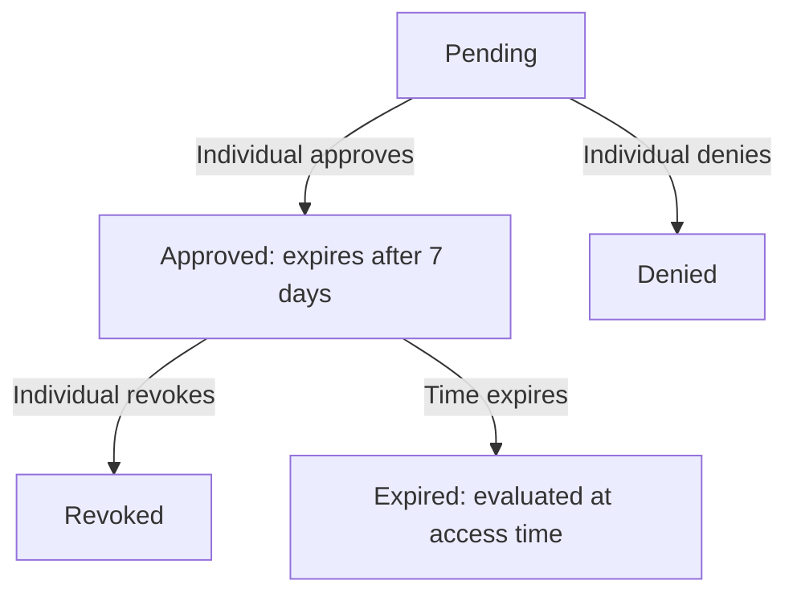

# Architecture and Data Model

## Stack

pnpm monorepo; React/Vite frontend in `artifacts/training-platform`; Express API in `artifacts/api-server`; PostgreSQL/Drizzle schema in `lib/db/src/schema`. Authentication is handled by the existing Replit auth integration. Private learning materials use object storage.

## Trust boundaries

The server, not the React UI, enforces ownership and consent. The potential service uses the authenticated user ID as the source of truth for profiles, not a user-supplied `userId`.

## Potential data entities

- `potential_profiles`: one row per user; voluntary profile.
- `potential_evidence`: user-owned self-reported skill, project and reflection claims.
- `career_opportunities`: opportunity published by an organisation admin.
- `employer_access_requests`: requesting organization, target, purpose, scope, status, expiry.
- `employer_access_audit`: append-only creation, decision and access events.

## Consent state machine

Access is never granted on request creation. An access read checks organization admin role, requested scope, approved status, feature flag and expiry at the moment of reading, then records an audit event. Portfolio disclosures expose only projects, achievements and self-reported skills. Professional disclosure adds declared strengths and interests. School marks, private academic grades, childhood observations and free-text private reflections are not included.

## Known architectural limitations

- Organization owner/admin eligibility is not yet equivalent to **verified paid corporate** eligibility.
- No guardian/minor flags exist in this phase. Employer access therefore stays disabled by default.
- Audits are database events; stricter immutability and tamper-evident logging require implementation.
- Access revocation stops future API calls but cannot recall previously downloaded information.
- No file attachments are accepted as potential evidence in this phase.
- Potential engine has no independent AI inference. Any future AI insight needs a versioned evidence trail, confidence/uncertainty display and human appeals workflow.
