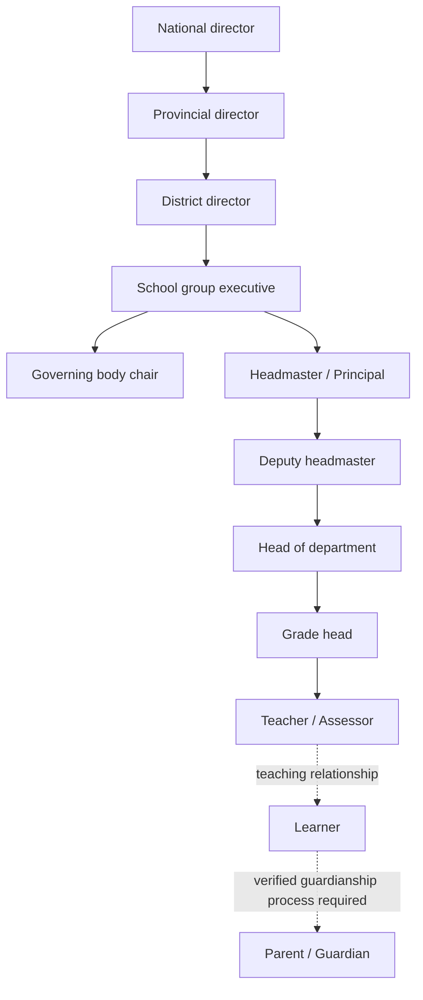

# CABO Education Governance Hierarchy

## Purpose and authority

Organisations are not flat. CABO now models reporting chains using tenant-contained management units (national, province, district, group, school, department, grade, class) and ranked, explicitly granted responsibilities. The hierarchy does not automatically give access to personal learner details or to another institution's academic database.

### Responsibility chain

These labels describe an aspirational governance arrangement. Actual reporting structures vary among state schools, independent schools and higher-education institutions; a governing body chair is not automatically the headmaster's line manager. Implemented management units and role assignments are configuration for each organisation, not claims about official South African Department of Basic Education appointments.

## Implemented server model

`management_units`: `id`, `organization_id`, `parent_id`, `name`, `type`, creator, timestamp.

`management_role_grants`: `id`, `organization_id`, `unit_id`, `user_id`, `role`, grantor, timestamp; unique per user/unit/role.

Only an authenticated organisation member may query its hierarchy. Bootstrap **organisation owner** can establish the root, create contained units and delegate. A delegated manager can create child units and assign roles with *strictly lower* authority inside their descendant scope. User must already belong to the same organisation. Higher authority does not automatically cross into other organisations. Units can only be added under a valid same-tenant parent and below the parent's level; no cross-tenant parent IDs or arbitrary existing-tree reparenting endpoint exists.

### Role experiences

| Role | Intended home view | API level |
|---|---|---|
| National / provincial / district director | Reporting scope and lower-level units | Delegated descendant hierarchy |
| Group executive / governing body chair | Managed schools, delegated people | Descendant hierarchy |
| Headmaster | Own school's governance and authorised functions | Scoped to assigned school |
| Deputy / department / grade head | Managed assigned subordinate units | Descendant hierarchy |
| Teacher / assessor / administrator | Own appointed unit, existing classroom / marking tools only where separately authorised | Own unit only |
| Learner | Own development, learning and academic tasks | No management hierarchy |
| Parent / guardian | Relationship invitation and future consent-safe summaries | No management hierarchy |

The first UI release is a **Governance** workspace which changes contents and available management actions according to user grants. It does *not yet* replace every dashboard, grading API or content screen with a dedicated role-specific portal. Academic and institution endpoint access checks require a coordinated second phase so hierarchy authority never inadvertently bypasses those checks.

## API

- `GET /api/organizations/:orgId/hierarchy`: returns only the caller's visible units, assignments and own roles, `Cache-Control: no-store`.
- `POST /api/organizations/:orgId/hierarchy/units`: owner creates root or manager creates contained subordinate units.
- `POST /api/organizations/:orgId/hierarchy/grants`: assign a less powerful role to an existing organisation member by email.
- `DELETE /api/organizations/:orgId/hierarchy/grants/:grantId`: remove a role below the caller's authority.

All routes authenticate and check organisation membership; role names are allowlisted. Parent and learner identities remain in their own domain-specific workflows, not delegated via a school leadership role-grant form.

## Data protection requirements

A hierarchy confers **management responsibility**, not unrestricted visibility of pupil grades, guardian contact details, psychometric results, health information or historical notes. Management reports should be aggregated and minimum-size suppressed to avoid identification where child safeguarding applies. Child/parent relationship verification and appropriate lawful authorisation must be implemented before guardian data is exposed.

## Important acceptance tests before release

- National managers see only descendant units in organisations to which they belong.
- Headmaster cannot appoint provincial/national directors.
- Teacher cannot appoint managers or read other schools' governance information.
- Caller cannot create unit with cross-tenant parent or non-descending level.
- A parent or learner sees no management roster.
- Organisation owner can bootstrap only one root.
- Role revocation blocks future delegated reads.
- Existing school exams, marking and enrolment endpoints preserve independent security checks.
- PostgreSQL schema reviewed and migrated against the dedicated Railway test database.
